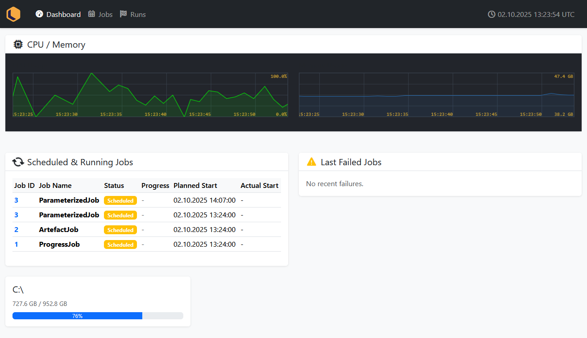

# Jobbr Dashboard

This is a basic Dashboard for the [Jobbr .NET JobServer](http://www.jobbr.io) via the Jobbr WebAPI to display job and job run information and manage triggers.

[](https://github.com/jobbrIO/jobbr/actions/workflows/ci.yml)
[](https://www.nuget.org/packages/Jobbr.Dashboard)
[](https://www.nuget.org/packages/Jobbr.Dashboard)



## Installation

First of all you'll need a working jobserver by using the usual builder as shown in the demos ([jobbrIO/demo](https://github.com/jobbrIO/demo)).
In addition to that you'll need to install the NuGet Package for this extension.

### NuGet

```powershell
Install-Package Jobbr.Dashboard
```

### Configuration

Since you already have a configured server, the registration of the provider is quite easy. See Example below.
The dashboard requires the [jobbr-webapi](https://github.com/jobbrIO/jobbr/tree/master/src/WebAPI) component to be installed.

```c#
using Jobbr.Dashboard

/* ... */

var builder = new JobbrBuilder();

const string baseAddress = "http://localhost";

jobbrBuilder.AddWebApi(config => config.BackendAddress = $"{baseAddress}:1338"); // you must host it under a different port (in future, this will be configurable)

jobbrBuilder.AddDashboard(config => config.BackendAddress = $"{baseAddress}:1337");

server.Start();
```

## Development

The Jobbr Dashboard is split into two directories:

- `Dashboard/` contains the backend implementation in addition to the Jobbr WebAPI
- `Dashboard.Frontend/` contains the frontend code written in React

# License

This software is licenced under GPLv3. See [LICENSE](LICENSE), and the related licences of 3rd party libraries below.

# Credits

This application was built by the following developers:
* [Michael Schnyder](https://github.com/michaelschnyder)
* [Oliver Zürcher](https://github.com/olibanjoli)
* [Roope Kivioja](https://github.com/RKivioja)
* [Lukas Dürrenberger](https://github.com/eXpl0it3r)
